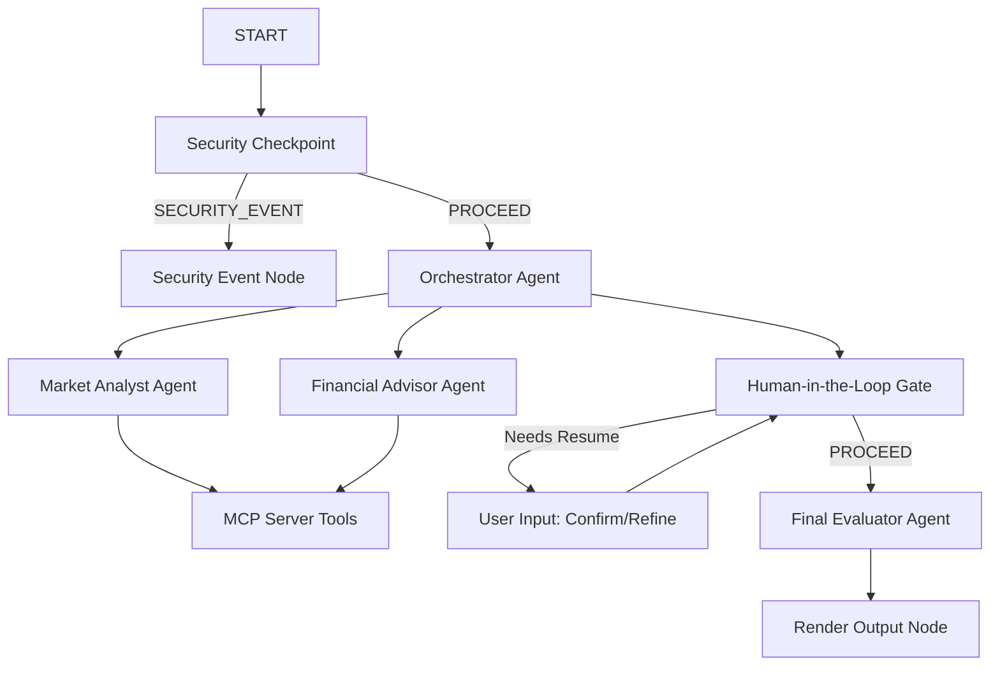
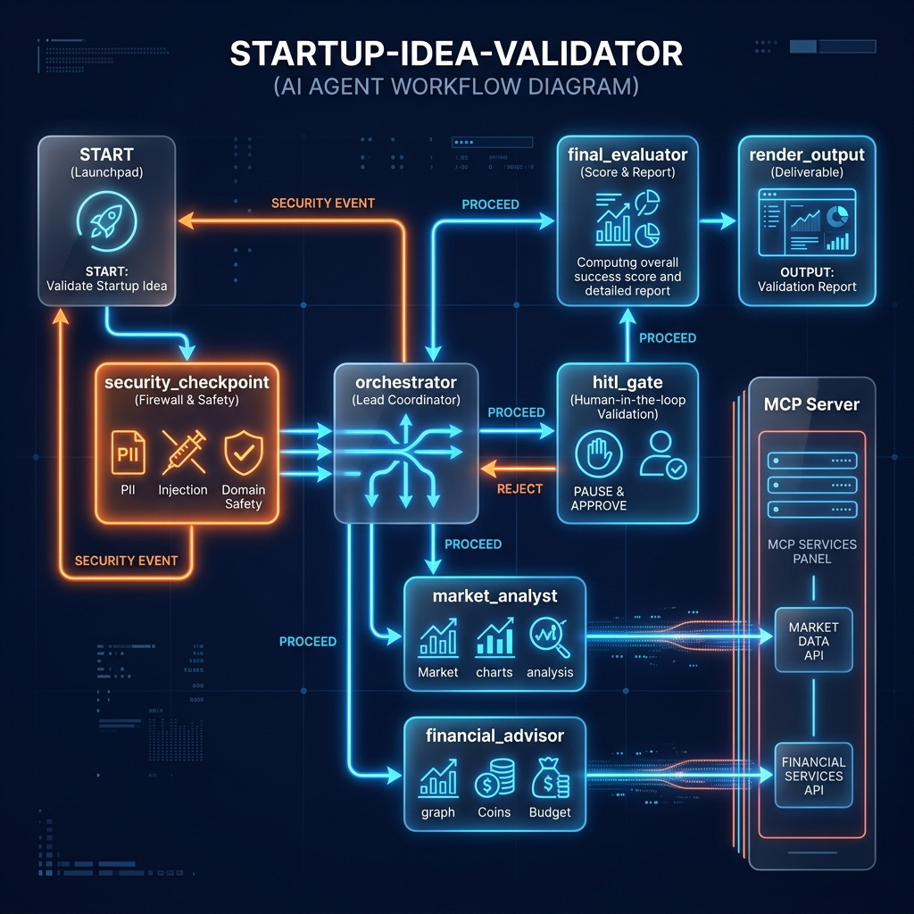
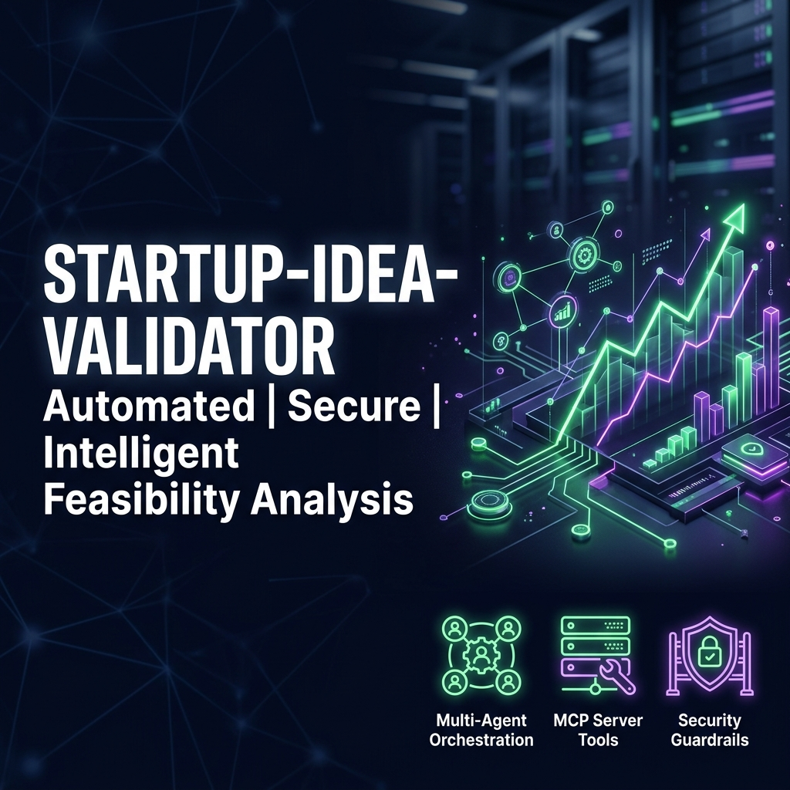

# AI-Powered Startup Validator

An AI-powered multi-agent system built using the Google Agent Development Kit (ADK 2.0) that evaluates startup ideas through market analysis, financial feasibility, risk assessment, and business validation. The system leverages Gemini 2.5 Flash and specialized AI agents to generate structured startup viability reports.
## Features

- Multi-Agent Startup Validation Workflow
- Google ADK 2.0 Implementation
- Gemini 2.5 Flash Integration
- Market Analysis
- SWOT Analysis
- Financial Feasibility Assessment
- Risk Identification
- Startup Viability Score
- Human-in-the-Loop Approval
- Security Checkpoint with PII Redaction
- Mock MCP Server for Market Intelligence

This system simulates an AI-powered startup evaluation committee similar to early-stage venture capital screening workflows.
- ## Tech Stack

- **Programming Language:** Programming Language: Python (3.11–3.13)
- **Framework:** Google Agent Development Kit (ADK 2.0)
- **Large Language Model:** Gemini 2.5 Flash
- **API Framework:** FastAPI
- **Protocol:** Model Context Protocol (MCP)
- **Data Validation:** Pydantic
- **Application Server:** Uvicorn
- **Package Manager:** uv
- **Infrastructure:** Terraform
- **Version Control:** Git & GitHub

## Prerequisites

- **Python 3.11+** (Python 3.11–3.13 supported)
- **uv** (recommended Python package manager)
- **Gemini API Key** from [Google AI Studio](https://aistudio.google.com/apikey)

## Quick Start

1. Clone the repository:

```bash
git clone https://github.com/RedrouthuDeshmasaikavalli/ai-powered-startup-validator.git
cd ai-powered-startup-validator
```

2. Create and configure your environment file:
   ```bash
   cp .env.example .env
   # Add your GOOGLE_API_KEY in the .env file
   ```

3. Install project dependencies:
   ```bash
   make install
   ```

4. Launch the local developer playground:
   ```bash
   make playground
   ```
   This will start the local server and open the ADK playground UI at [http://localhost:18081](http://localhost:18081).

---
-Used by founders, accelerators, and incubators to quickly evaluate startup feasibility before investment decisions.

## Solution Architecture



The system contains:
- **`security_checkpoint`**: A workflow function node filtering prompt injection, sanitizing PII, and checking for banned startup industries (e.g. weapons, drugs).
- **`orchestrator`**: A lead `LlmAgent` coordinating with two domain experts.
- **`market_analyst`**: A specialized sub-agent that pulls data from the local MCP server to examine TAM/SAM/SOM and key competitors.
- **`financial_advisor`**: A specialized sub-agent that checks average CAC, pricing, and profit margins via MCP.
- **`hitl_gate`**: An interactive checkpoint requiring the user to approve initial findings or input refinements.
- **`final_evaluator`**: An agent that digests findings and user corrections to return a structured feasibility scorecard.
-The system follows a modular multi-agent workflow where each agent is responsible for a specific evaluation domain and operates through a centralized orchestrator.

---

## Assets

### Workflow Diagram


### Cover Page Banner


---

## How to Run

- **Interactive Playground UI:**
  ```bash
  make playground
  ```
  Launches the interactive web-based playground at [http://localhost:18081](http://localhost:18081).

- **API Web Server Mode:**
  ```bash
  make run
  ```
  Launches the production-ready FastAPI application server at `http://localhost:8080`.

---

## Sample Test Cases

### Test Case 1: Standard Valid Tech Idea
- **Input:**
  ```json
  {
    "idea": "A micro-investment platform for children to learn financial literacy with parental controls.",
    "target_audience": "Parents with kids aged 8-15",
    "problem_statement": "Children lack financial literacy, and traditional banking apps are too complex.",
    "industry_market": "Fintech / Edtech",
    "location": "United States",
    "budget": "$50,000 self-funded"
  }
  ```
- **Expected Flow:**
  - Passes `security_checkpoint` with `INFO` log status.
  - `orchestrator` fetches analysis from sub-agents using MCP tools.
  - Pauses at `hitl_gate` and asks user to confirm.
- **Check in Playground:**
  - The UI will output the initial assessment and show a response box requesting input.
  - Submitting `approve` will resume the workflow and display the final Viability Scorecard (e.g. Score: 85/100, Recommendation: Strong Match).

### Test Case 2: PII Redaction Check
- **Input:**
  ```json
  {
    "idea": "A private consulting service. Reach out to me at admin@mysecretstartup.com or 555-019-2834.",
    "target_audience": "Small businesses",
    "problem_statement": "Need expert business consulting.",
    "industry_market": "Consulting",
    "location": "Global",
    "budget": "$10,000"
  }
  ```
- **Expected Flow:**
  - `security_checkpoint` runs regex checks and detects PII.
  - The email and phone number are replaced with `[EMAIL_SCRUBBED]` and `[PHONE_SCRUBBED]`.
- **Check in Playground/Logs:**
  - Verify that the terminal logs output `{"event": "security_checkpoint_evaluation", "checks": ["pii_scrubbed: email", "pii_scrubbed: phone"]}`.
  - The initial assessment outputted by the orchestrator will only see the scrubbed version of the idea.

### Test Case 3: Security Violation (Banned Category)
- **Input:**
  ```json
  {
    "idea": "An anonymous online catalog for selling illegal drugs and weapons.",
    "target_audience": "Darknet buyers",
    "problem_statement": "Difficulty purchasing weapons safely.",
    "industry_market": "Retail / Black Market",
    "location": "Worldwide",
    "budget": "$10,000"
  }
  ```
- **Expected Flow:**
  - `security_checkpoint` flags the banned keyword `weapons` / `drugs`.
  - Routes immediately to `security_event`.
- **Check in Playground:**
  - The validation halts immediately. The UI outputs `❌ Validation Blocked: Security violation: Startup idea matches banned business category 'weapons'.`

---

## Troubleshooting

1. **`404 Model Not Found` Error:**
   - Make sure your `.env` lists `GEMINI_MODEL=gemini-2.5-flash`. The old `gemini-1.5-*` models are retired and return 404.
2. **`uv sync` fails with hardlink errors (OneDrive/Windows):**
   - In your terminal, run `$env:UV_LINK_MODE="copy"` before running `make install` or `uv sync`. OneDrive does not support NTFS hardlinks.
3. **Changes to `agent.py` or `mcp_server.py` are not picked up (Windows):**
   - On Windows, playground hot-reload is disabled due to event loop locks. Close your server with `CTRL+C`, or execute this in PowerShell to force-kill:
     ```powershell
     Get-Process -Id (Get-NetTCPConnection -LocalPort 18081, 8090 -ErrorAction SilentlyContinue).OwningProcess | Stop-Process -Force
     ```
     Then start a fresh server.
4. **`503 UNAVAILABLE` or High Demand Error:**
   - This occurs when the Gemini API is experiencing high traffic or temporary overload.
   - Solution: Retry after a few seconds or restart the request.
   - This is a temporary issue from the model provider and does not indicate a problem in the application code.

---

## Demo Script

A presentation script is included in [`DEMO_SCRIPT.txt`](DEMO_SCRIPT.txt) to assist with the project demonstration and presentation.

---
## 📄 License
This project is developed for academic and learning purposes as part of a capstone submission. You are free to explore, modify, and extend it for educational use.
## 👤 Author

**Redrouthu Deshma saikavalli**


---

