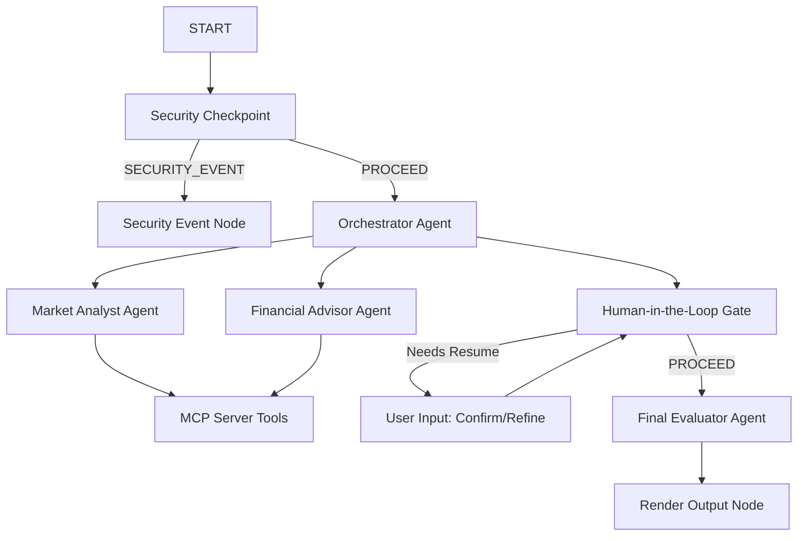

# Submission Write-Up: Startup Idea Validator Agent

## Problem Statement
Evaluating new startup concepts is highly subjective, time-consuming, and prone to "confirmation bias" for founders. Early-stage entrepreneurs often build products before performing proper market size estimations, analyzing competitors, or examining financial viability. 

The **Startup Idea Validator Agent** automates this crucial validation step by simulating a multi-agent system of experts (market research analyst and financial advisor) to quickly and objectively vet ideas.

---

## Solution Architecture

---

## Concepts Used & File References

1. **ADK 2.0 Workflow:**
   Defined using a graph-based state-machine topology with conditional routes.
   - *File Reference:* [`app/agent.py`](file:///c:/Users/Deshma/OneDrive/Desktop/Project-Idea-Generator/startup-idea-validator/app/agent.py#L189-L203) (`Workflow` definition).

2. **LlmAgent / Agent:**
   Used for specialized expert roles and the lead orchestrator.
   - *File Reference:* [`app/agent.py`](file:///c:/Users/Deshma/OneDrive/Desktop/Project-Idea-Generator/startup-idea-validator/app/agent.py#L35-L77) (`market_analyst`, `financial_advisor`, and `orchestrator` instances).

3. **AgentTool:**
   Exposes agents to each other to facilitate delegation (orchestrator delegates to market and financial specialists).
   - *File Reference:* [`app/agent.py`](file:///c:/Users/Deshma/OneDrive/Desktop/Project-Idea-Generator/startup-idea-validator/app/agent.py#L75) (`tools=[AgentTool(market_analyst), AgentTool(financial_advisor)]`).

4. **MCP Server:**
   A local Model Context Protocol (MCP) server built with Python's FastMCP SDK running over stdio transport. Exposes data simulation tools to the agents.
   - *File Reference:* [`app/mcp_server.py`](file:///c:/Users/Deshma/OneDrive/Desktop/Project-Idea-Generator/startup-idea-validator/app/mcp_server.py) (All tools).
   - *File Reference:* [`app/agent.py`](file:///c:/Users/Deshma/OneDrive/Desktop/Project-Idea-Generator/startup-idea-validator/app/agent.py#L31-L34) (`McpToolset` setup).

5. **Security Checkpoint:**
   Custom security gateway screening inputs for injections, scrubbing PII, and checking for banned categories before executing reasoning.
   - *File Reference:* [`app/agent.py`](file:///c:/Users/Deshma/OneDrive/Desktop/Project-Idea-Generator/startup-idea-validator/app/agent.py#L97-L125) (`security_checkpoint` node function).

6. **Agents CLI:**
   Used for rapid scaffolding, package management via `uv`, environment file parsing, and playground GUI testing.
   - *File Reference:* [`agents-cli-manifest.yaml`](file:///c:/Users/Deshma/OneDrive/Desktop/Project-Idea-Generator/startup-idea-validator/agents-cli-manifest.yaml) (CLI metadata).

---

## Security Design

The security checkpoint implements three lines of defense:
1. **Domain Category Filter (Content Policy):** Checks the startup vertical and description against banned industries (weapons, illegal drugs, gambling). This prevents the model from generating business advice for illegal/unethical projects.
2. **Prompt Injection Screen:** Inspects for adversarial phrases trying to override system prompts. This prevents jailbreaks and keeps the agent focused on validation.
3. **PII Sanitizer:** Uses regular expressions to redact phone numbers and email addresses. This guarantees that user contact details are never leaked to external LLM providers.
4. **Structured JSON Audit Logs:** Emits JSON audits to stdout for traceability, categorizing events by severity (`INFO`, `WARNING`, `CRITICAL`).

---

## MCP Server Design

The FastMCP server exposes three domain-specific tools:
- **`get_competitors(industry, idea)`**: Returns major market leaders, market share summaries, and niche differentiator opportunities.
- **`estimate_market_size(industry, target_audience, location)`**: Calculates the Total Addressable Market (TAM), Serviceable Addressable Market (SAM), and Serviceable Obtainable Market (SOM) using simulation logic based on input parameters.
- **`get_revenue_benchmarks(industry)`**: Provides typical monetization strategies, profit margins, CAC targets, and LTV-to-CAC ratios.

---

## Human-in-the-Loop (HITL) Flow

A `RequestInput` interrupt occurs at the `hitl_gate` node. 
- **Why:** The Orchestrator's initial assessment is displayed to the user first. Before creating a permanent evaluation score, the user has the opportunity to review, correct misunderstandings, or adjust details (e.g. "Actually, our budget is $80k, not $50k").
- **How:** The node pauses execution and resumes only when the user submits their feedback (or "approve").

---

## Demo Walkthrough

1. **Happy Path (Test Case 1):** User submits a valid Fintech/Edtech idea. The system performs the checks, delegates tasks, and pauses for review. User types `approve`, triggering the final viability report containing a computed Score and structured market analysis.
2. **Privacy Scrubbing (Test Case 2):** Input containing raw phone numbers/emails is passed. The logs show `pii_scrubbed` flags, and the downstream agents only receive sanitized text.
3. **Policy Blocking (Test Case 3):** User submits a forbidden category idea (e.g. weapons marketplace). The validation halts immediately with `Validation Blocked` feedback, logging a `CRITICAL` severity event.

---

## Impact & Value Statement

The Startup Idea Validator Agent benefits:
- **Founders:** Helps they validate assumptions, identify competitors, and gauge financial margins in minutes.
- **Incubators & Accelerators:** Speeds up initial vetting of applications.
- **Innovation Teams:** Provides rapid prototyping of concept viability before internal corporate sponsorship.
